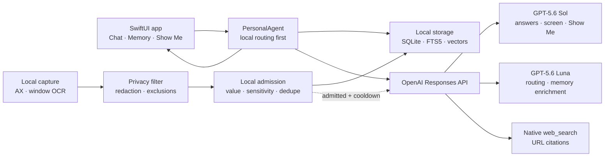

# iAletheia

iAletheia is a privacy-first personal memory assistant for macOS. It observes the active app with user-granted Accessibility and Screen Recording permissions, turns useful activity into searchable local memories, and answers questions using those memories, the current screen, or live web information.

Built for [OpenAI Build Week](https://openai.devpost.com/) in the **Apps for Your Life** track with Codex and the GPT-5.6 family.

## What it does

- Captures active-window text through Accessibility, with window-scoped OCR as a fallback.
- Filters excluded apps, sensitive windows, secrets, payment data, and other sensitive patterns before memory admission.
- Extracts, scores, deduplicates, links, and consolidates memories locally.
- Stores observations, memories, episodes, and chat history in local SQLite/FTS5 storage.
- Retrieves relevant memories with local lexical and vector search.
- Routes each question to direct, memory, live-screen, web, or memory-and-web handling.
- Uses GPT-5.6 Sol for user-facing reasoning and GPT-5.6 Luna for bounded background structuring and ambiguous query routing.
- Uses OpenAI's native Responses API `web_search` tool and returns source citations.
- Provides a **Show Me** overlay that guides the user through visible UI without clicking for them.
- Keeps a fully local fallback when cloud processing is disabled or unavailable.

## OpenAI architecture



All OpenAI work goes through [`OpenAIClient.swift`](Sources/iAletheia/OpenAI/OpenAIClient.swift) and `POST /v1/responses`.

### API choices

| Workload | Model | Reasoning | Output contract |
|---|---|---:|---|
| Direct and live-screen answers | `gpt-5.6-sol` | low | Text |
| Memory-grounded and session answers | `gpt-5.6-sol` | medium | Strict JSON Schema where citations/IDs must be recovered |
| Native live web answers | `gpt-5.6-sol` | medium | Text plus `url_citation` annotations |
| Show Me plans | `gpt-5.6-sol` | low | Strict JSON Schema |
| Ambiguous query routing | `gpt-5.6-luna` | none | Strict JSON Schema |
| Automatic memory enrichment | `gpt-5.6-luna` | none | Strict JSON Schema |

The app deliberately does not use Chat Completions, a third-party search API, remote embeddings, or a vision upload path. Local capture produces redacted text; user-facing reasoning and native search use Responses.

Every request sets:

- `store: false`
- an app-generated stable pseudonymous `safety_identifier`
- an explicit `reasoning.effort`
- a bounded `max_output_tokens`
- low or medium text verbosity

Web requests declare `tools: [{ "type": "web_search", "search_context_size": "low" }]`. Structured tasks use `text.format.type = "json_schema"` with `strict: true`.

## Cost controls

Current standard GPT-5.6 text prices per one million tokens are:

| Model | Input | Cached input | Output | Use here |
|---|---:|---:|---:|---|
| GPT-5.6 Sol | $5.00 | $0.50 | $30.00 | User-facing reasoning |
| GPT-5.6 Terra | $2.50 | $0.25 | $15.00 | Optional lower-cost Sol override |
| GPT-5.6 Luna | $1.00 | $0.10 | $6.00 | Routing and background structuring |

Illustrative standard-processing estimates, before any web-search tool fee:

| Operation | Example tokens | Estimated cost |
|---|---:|---:|
| Sol answer | 6,000 input + 600 output | about $0.048 |
| Sol Show Me plan | 4,000 input + 400 output | about $0.032 |
| Luna route classification | 500 input + 100 output | about $0.0011 |
| Luna memory enrichment | 2,000 input + 300 output | about $0.0038 |

Actual reasoning and tool usage can change these figures. Native web search also has a per-tool-call charge, so web search is user-toggleable and is never used for questions that local routing classifies as direct, memory, or live screen.

Automatic memory enrichment is bounded in four ways:

1. Sensitive or low-value observations are rejected locally first.
2. Only candidates scoring at the durable-memory threshold can trigger automatic enrichment.
3. Screen text sent for enrichment is capped at 4,000 characters.
4. Automatic enrichments share a five-minute default cooldown. During eight continuous hours, that caps the path at 96 calls (roughly $0.36 using the example above). An explicit user capture may bypass the cooldown.

To prioritize quality less aggressively, set `OPENAI_REASONING_MODEL=gpt-5.6-terra`; no code change is required.

## Privacy boundary

| Data | Location / behavior |
|---|---|
| Screenshots | Used transiently for local OCR; not saved or uploaded |
| Raw active-window text | Filtered and redacted locally |
| Memories, observations, episodes, chat | Local database |
| Embeddings and retrieval index | Local |
| OpenAI API key | macOS Keychain (or `.env.local` for development) |
| Cloud answer context | Only redacted text needed for an enabled request |
| Responses application state | Disabled with `store: false` |

`store: false` does not by itself promise Zero Data Retention; standard API abuse-monitoring retention and the account's data-control settings still apply. Cloud processing can be disabled in Settings, leaving capture, memory storage, retrieval, and fallback answers local.

## Requirements

- macOS 14 or newer
- Xcode 15+ / Swift 5.9+
- Screen Recording and Accessibility permissions
- An OpenAI API organization with access to GPT-5.6 for cloud features

OpenAI Build Week's Codex credits and OpenAI API billing are separate. Running this app's GPT/API features uses the API key and billing configured on the OpenAI Platform account.

## Setup

```bash
cp .env.local.example .env.local
```

Set at least:

```dotenv
OPENAI_API_KEY=sk-your-openai-api-key-here
OPENAI_BASE_URL=https://api.openai.com/v1
OPENAI_REASONING_MODEL=gpt-5.6-sol
OPENAI_UTILITY_MODEL=gpt-5.6-luna
OPENAI_MEMORY_ENRICHMENT_COOLDOWN_SECONDS=300
```

For normal use, paste the API key in **Settings → OpenAI** so it is saved in Keychain. The environment file is intended for local development and is gitignored.

Build and run:

```bash
swift build
./run.sh
```

Run tests:

```bash
swift test --disable-sandbox
```

## Project structure

```text
Sources/iAletheia/
├── App/          AppState, dependency wiring, environment loading
├── Capture/      Active app, Accessibility, browser metadata, OCR
├── Chat/         Chat sessions and persistence
├── Memory/       Extraction, admission, dedupe, consolidation, linking
├── Observation/  Pipeline, fingerprints, shared models
├── OpenAI/       Responses API client, schemas, web citation parser
├── Privacy/      Exclusions, sensitivity detection, redaction
├── Retrieval/    Local hybrid retrieval and query expansion
├── ShowMe/       Plans, target finding, overlay controller
├── Storage/      SQLite repositories, FTS5, local vectors
├── Tools/        Personal agent, router, answer sanitization
└── UI/           SwiftUI app, chat, settings, memory inspector, owl
```

## OpenAI Build Week and Codex work

The project was created during the submission period. Codex was used as an engineering collaborator, not only for planning. The Build Week implementation includes:

- the full Responses API provider integration;
- GPT-5.6 Sol/Luna workload partitioning and explicit reasoning settings;
- strict structured-output schemas for memory extraction, routing, memory answers, and Show Me plans;
- native web-search annotations and citation parsing;
- local admission gating and the automatic-enrichment cost ceiling;
- OpenAI-key privacy redaction and `store: false` request controls;
- provider migration across dependency injection, settings, chat, live screen, Show Me, tests, and documentation;
- executable-target test integration and Responses API parser tests.

Evidence for the submission can be taken from the dated Git history and the timestamped Codex task that performed and verified this migration. The demo should explicitly show Codex's code contribution, a GPT-5.6-powered answer, a native web-search answer with citations, and the cloud-processing privacy toggle.

## Verification status

- `swift build --disable-sandbox`: passing
- `swift test --disable-sandbox`: 7 tests passing
- Live paid API smoke test: intentionally not run without the entrant's API key

## License

MIT
