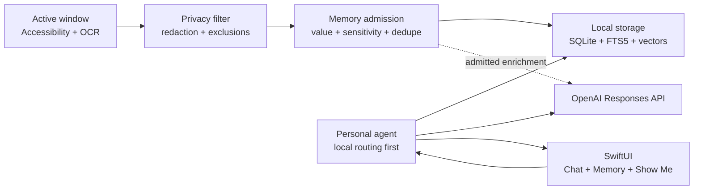

# iAletheia

iAletheia is a privacy-first personal memory assistant for macOS. It learns from useful on-screen activity, stores memories locally, and answers questions using personal context, the current screen, or live web information.

Built with Codex and the GPT-5.6 family for [OpenAI Build Week](https://openai.devpost.com/) in the **Apps for Your Life** category.

## Features

- Active-window capture through macOS Accessibility APIs and local OCR
- Local privacy filtering, secret redaction, and app/site exclusions
- Local memory extraction, admission scoring, deduplication, linking, and consolidation
- SQLite, FTS5, and local-vector memory retrieval
- Direct, memory, live-screen, web, and hybrid answer routing
- GPT-5.6-powered answers with structured outputs
- Native OpenAI web search with source citations
- Live-screen code review, page summaries, and message drafting
- **Show Me** guidance that points to visible controls without clicking for the user
- Local fallback when cloud processing is disabled or unavailable

## Architecture



All cloud requests go through [`OpenAIClient.swift`](Sources/iAletheia/OpenAI/OpenAIClient.swift) using `POST /v1/responses`.

### Model usage

| Workload | Model | Reasoning |
|---|---|---|
| Answers, live screen, memory reasoning, web search, Show Me | `gpt-5.6-sol` | low or medium |
| Query routing and memory enrichment | `gpt-5.6-luna` | none |

Structured tasks use strict JSON Schema. Web answers use the native `web_search` tool and parse OpenAI URL-citation annotations.

Every request uses:

- `store: false`
- a stable pseudonymous `safety_identifier`
- an explicit reasoning effort
- bounded output tokens
- low or medium text verbosity

## Privacy and cost controls

- Screenshots are processed locally for OCR and are not saved or uploaded.
- Sensitive windows and high-sensitivity observations are discarded locally.
- Secrets, API keys, card numbers, and private-key material are redacted.
- Memories, chat history, episodes, embeddings, and search indexes remain local.
- Only redacted text required for an enabled cloud feature is sent to OpenAI.
- Automatic memory enrichment happens only after local admission scoring.
- Enrichment input is capped at 4,000 characters and has a five-minute default cooldown.
- Web search and cloud processing can be disabled independently in Settings.

`store: false` disables Responses API application-state storage, but standard API data-control and abuse-monitoring policies still apply.

## Requirements

- macOS 14 or newer
- Xcode 15+ and Swift 5.9+
- Screen Recording permission
- Accessibility permission
- An OpenAI API key with GPT-5.6 access for cloud features

## Setup

Copy the environment template:

```bash
cp .env.local.example .env.local
```

Configure the OpenAI API:

```dotenv
OPENAI_API_KEY=sk-your-openai-api-key
OPENAI_BASE_URL=https://api.openai.com/v1
OPENAI_REASONING_MODEL=gpt-5.6-sol
OPENAI_UTILITY_MODEL=gpt-5.6-luna
OPENAI_MEMORY_ENRICHMENT_COOLDOWN_SECONDS=300
```

Alternatively, save the API key in **Settings → OpenAI**. The app stores it in macOS Keychain.

Build and run:

```bash
swift build
./run.sh
```

Run tests:

```bash
swift test --disable-sandbox
```

## Project structure

```text
Sources/iAletheia/
├── App/          Application state and dependency wiring
├── Capture/      Active-window capture and OCR
├── Chat/         Chat sessions and persistence
├── Memory/       Extraction, admission, deduplication, and linking
├── Observation/  Observation pipeline and shared models
├── OpenAI/       Responses API client and response parsing
├── Privacy/      Exclusions, sensitivity detection, and redaction
├── Retrieval/    Local hybrid memory retrieval
├── ShowMe/       Guidance plans, target finding, and overlays
├── Storage/      SQLite, FTS5, and local vectors
├── Tools/        Personal agent and query router
└── UI/           SwiftUI application views
```

## OpenAI Build Week

The project was created during the submission period. Codex was used for architecture review, implementation, the OpenAI migration, cost controls, testing, and documentation. GPT-5.6 powers the application's cloud reasoning, structured extraction, and web-search workflows.

## Verification

- `swift build --disable-sandbox` passes
- `swift test --disable-sandbox` passes all 7 tests
- A live API smoke test requires the entrant's OpenAI API key and GPT-5.6 access

## License

MIT
