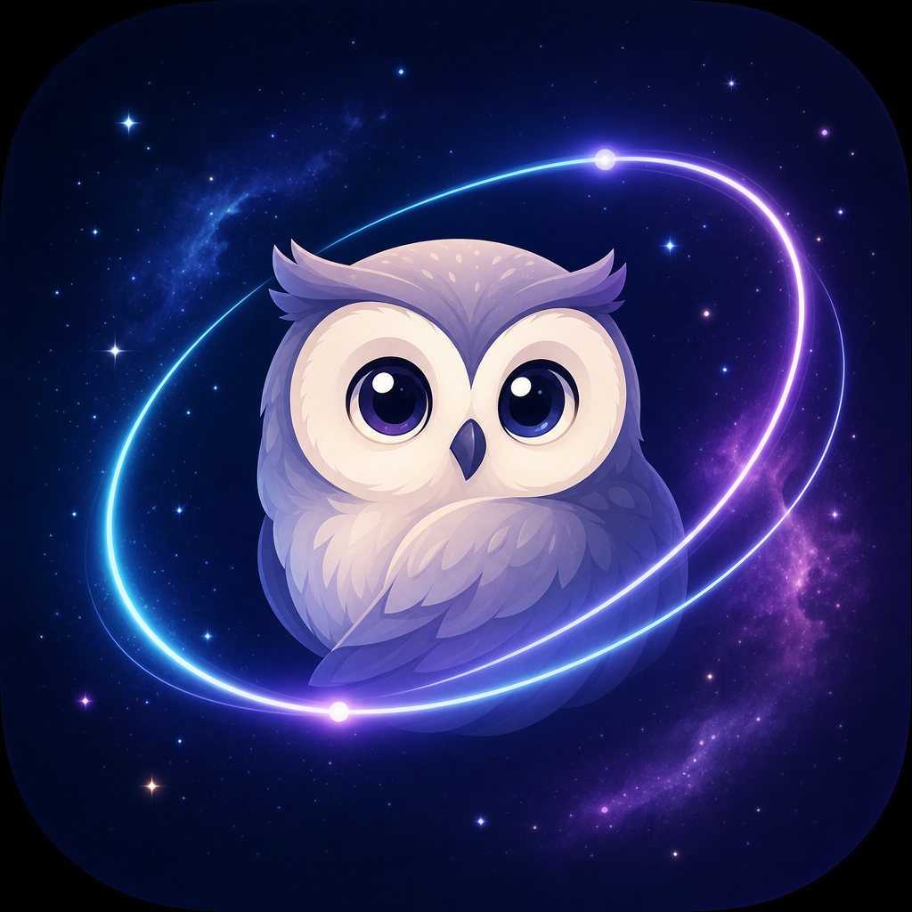

# iAletheia

**iAletheia** (Greek: ἀλήθεια — truth, un-forgetting) is a privacy-first **personal agent for macOS**.

It quietly learns from your screen, builds a private local memory, and answers with what you were actually working on — including **live screen awareness** (see the active window, draft email replies, review code) and **Qwen Cloud** for reasoning and web search.

Built for **Track 1: MemoryAgent** — [Global AI Hackathon Series with Qwen Cloud](https://qwencloud-hackathon.devpost.com/).

<p align="center">
  
</p>

---

## Highlights

| Capability | What you get |
|---|---|
| **Personal memory** | Screen → OCR / Accessibility → local SQLite + FTS5 (screenshots never saved) |
| **Live screen** | “What’s on my screen?” / “Draft a reply to this email” uses the **frontmost** window |
| **Show Me** | Step-by-step on-screen instructor (pointer + chat) — guides you, never clicks for you |
| **Session chat** | Multi-turn awareness in the current chat; full **Chat History** of past sessions |
| **Smart routing** | Direct · memory · live screen · web · hybrid — via Qwen when configured |
| **Privacy** | Redaction, exclusions, local storage under Application Support |

---

## Demo prompts

| Type | Example |
|---|---|
| Live screen | “Can you see my screen?” |
| Show Me | Toggle **Show Me**, then “Where can I find Capitalize?” |
| Email assist | “Draft a reply for this email” |
| Code context | “What am I looking at?” → “Is there any error in this?” |
| Personal recall | “What was I researching about storage yesterday?” |
| Live web | “What’s new with Qwen Cloud this month?” |
| Hybrid | “Compare what I read about HBM with current GPU specs” |

---

## Architecture

```text
┌──────────────────────────────────────────────────────────────┐
│                     macOS (local / edge)                      │
│                                                              │
│  ScreenCaptureKit + Accessibility + Vision OCR               │
│  → frontmost window (multi-display / multi-window safe)      │
│           ↓                                                  │
│  Privacy filter + dedup + memory extraction                  │
│           ↓                                                  │
│  SQLite + FTS5 + on-device embeddings + chat history         │
│           ↓                                                  │
│  Floating owl widget · Main app · Memory Inspector           │
└──────────────────────────┬───────────────────────────────────┘
                           │  ask / follow-up
                           ▼
┌──────────────────────────────────────────────────────────────┐
│                 Personal Agent (Qwen Cloud)                  │
│  Route → retrieve memories and/or capture live screen        │
│  → optional DashScope web search → grounded plain-text answer│
└──────────────────────────────────────────────────────────────┘
```

### Privacy model

| Stage | Location |
|---|---|
| Screen capture & OCR | Local only |
| Memory & chat history | Local (`~/Library/Application Support/iAletheia/`) |
| Embeddings | On-device (Apple NaturalLanguage) |
| Screenshot persistence | **Never** (ephemeral capture only) |
| Qwen Cloud | Query-time reasoning / search only |
| Secrets | Keychain and/or `.env.local` (never committed) |

---

## Features

- Full macOS app: **Home**, **Memories**, **Chat**, **Chat History**, **About Me**, **Agent**, **Settings**
- Floating owl widget — open chat anytime; learning continues in the background
- Live screen actions: describe the active window, draft copy-paste email replies, review visible code
- Session-aware chat + persisted history of every conversation
- Smart entity memory (merge same people/topics, learn how you like answers)
- About Me + Agent personality (tone, length, custom instructions)
- Auto-observe ~every 2s → text kept, image discarded
- Pin / forget / clear-all for local data

---

## Requirements

- macOS 14+
- Xcode 15+ / Swift 5.9+
- Apple Silicon recommended
- **Screen Recording** and **Accessibility** permissions
- A [DashScope / Qwen Cloud](https://www.alibabacloud.com/help/en/model-studio/) API key

---

## Quick start

```bash
git clone <your-repo-url> iAletheia
cd iAletheia

cp .env.local.example .env.local
# Edit .env.local and set QWEN_API_KEY

chmod +x run.sh
./run.sh
```

Or manually:

```bash
cp .env.local.example .env.local   # then add your key
swift build -c release
.build/release/iAletheia
```

### Permissions

1. Launch the app (menu bar / floating owl)
2. Grant **Screen Recording** and **Accessibility** for iAletheia
3. Click the owl to chat

### Configuration

| Source | Priority |
|---|---|
| Keychain (Settings in-app) | Highest |
| `.env.local` | Next |
| Environment variables | Fallback |

`.env.local` is **gitignored**. Only commit `.env.local.example` (placeholders).

Example `.env.local`:

```env
QWEN_API_KEY=sk-your-dashscope-api-key-here
QWEN_BASE_URL=https://dashscope-intl.aliyuncs.com/compatible-mode/v1
QWEN_TEXT_MODEL=qwen3.7-plus
```

---

## Project structure

```text
Sources/iAletheia/
├── App/            AppState, DependencyContainer, entry
├── Capture/        ScreenCaptureKit, Accessibility, active window
├── Chat/           Session models + chat history persistence
├── Privacy/        Filters, redaction, exclusions
├── Observation/    Live snapshot + observation pipeline
├── Memory/         Extraction, entities, chat learning
├── Retrieval/      Hybrid FTS + vector search
├── Tools/          PersonalAgent, QueryRouter, web helpers
├── Qwen/           DashScope client, AnswerSanitizer
├── Storage/        SQLite, repositories, preferences
└── UI/             Main app, owl widget, chat, inspector
```

---

## Security notes

- **Do not commit** `.env`, `.env.local`, or real API keys.
- If a key was ever pasted into chat, screenshots, or a public branch, **rotate it** in the DashScope console.
- Password managers and sign-in flows are excluded from memory by default; secrets in text are redacted before storage.

---

## Hackathon submission

- **Track:** MemoryAgent (Track 1)
- **License:** MIT
- **Alibaba Cloud proof:** Qwen / DashScope via `QwenClient.swift`
- **Differentiator:** Local visual memory + live frontmost-window awareness + session chat; not a generic chatbot

---

## License

MIT — see [LICENSE](LICENSE).