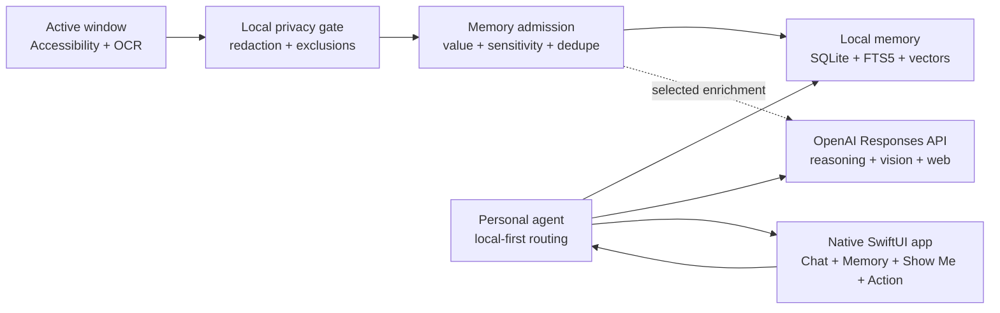

# iAletheia

**A privacy-first personal memory and action assistant for macOS.**

iAletheia helps you recover what you have seen, understand what is currently on your screen, search the live web when needed, and prepare work inside the app you are already using. It combines local memory and privacy controls with GPT-powered reasoning, visual guidance, and carefully constrained computer interaction.

Built with Codex and the GPT-5.6 family for [OpenAI Build Week](https://openai.devpost.com/) in the **Apps for Your Life** category.

## Why iAletheia

Finding something again usually requires remembering where it was stored. iAletheia is designed for the moments when you remember the idea but not the application, page, title, or exact wording.

You can ask:

- “What was I researching yesterday?”
- “Where did I see that tool for generating diagrams?”
- “Summarize what is currently on my screen.”
- “Compare this page with current information from the web.”
- “Show me how to find a file in this interface.”
- “Draft a reply to this email, but do not send it.”

The assistant decides whether to answer from personal memory, the live screen, the web, general reasoning, or a combination of those sources.

## Core experiences

### Personal memory

iAletheia observes useful active-window activity, filters it locally, and turns selected observations into searchable memories. Memories are deduplicated, linked, consolidated, and retrieved through local full-text and vector search.

### Live-screen understanding

The assistant can interpret the active window for tasks such as page summaries, code review, explanation, and contextual drafting. It tracks the exact active application and window instead of assuming that the largest visible window is the intended target.

### Web-assisted answers

When current information is needed, iAletheia uses OpenAI's native web-search tool and surfaces source citations with the answer. Web search can be disabled independently in Settings.

### Show Me

Show Me converts a request into step-by-step visual guidance. It identifies visible controls using Accessibility data, OCR, and GPT visual reasoning, then places a click-through pointer over the relevant location without clicking for the user.

### Action mode

Action mode is an explicit, opt-in workflow that can visibly move the cursor and type a draft into a verified editor. For an email reply, it follows a closed loop:

1. Capture the intended active window.
2. Find and click Reply.
3. Capture the changed screen.
4. Verify that a composer opened.
5. Locate and focus the editable message body.
6. Capture and verify the focused state.
7. Type the draft visibly.
8. Stop before Send.

Action mode is intentionally **draft-only**. It has no operation for Send, Submit, Post, Publish, Purchase, Delete, or Confirm. Recipient, subject, search, and other unsafe fields are rejected locally.

## How it works



### Visual grounding

Dynamic browser interfaces do not always expose reliable semantic controls. iAletheia therefore combines:

- Exact application, window, and display tracking
- macOS Accessibility roles and geometry
- Local Vision OCR with bounding boxes
- Fresh screenshots after state-changing actions
- GPT visual reasoning using a labeled 12×8 screenshot grid
- Local coordinate validation and prohibited-target checks

The model returns a grid cell and an offset within that cell. iAletheia converts this into macOS screen coordinates, rejects implausible or unsafe targets, performs the allowed action, and observes the resulting state before continuing.

## OpenAI integration

All OpenAI requests use the [Responses API](https://platform.openai.com/docs/api-reference/responses) through `POST /v1/responses`.

| Workload | Model configuration | Reasoning |
|---|---|---|
| Answers, memory synthesis, live-screen analysis, Show Me, Action vision, and web-assisted responses | `OPENAI_REASONING_MODEL` | Low or medium |
| Query routing and selected memory enrichment | `OPENAI_UTILITY_MODEL` | None or low |

The default development configuration uses `gpt-5.6-sol` for reasoning and `gpt-5.6-luna` for utility workloads. Both are configurable through environment variables.

Structured workflows use strict JSON Schema, including:

- Query-route selection
- Memory extraction
- Show Me plans
- Draft-only action plans
- Grid-grounded click targets
- Post-action UI-state verification

Every request uses bounded output tokens, explicit reasoning effort, a stable pseudonymous safety identifier, and `store: false`.

## Privacy and safety

Privacy boundaries are part of the observation pipeline rather than an afterthought:

- Screen content is processed locally for OCR and is not saved as screenshots.
- Memories, chat history, episodes, embeddings, and search indexes remain local.
- Sensitive windows and high-sensitivity observations are discarded locally.
- API keys, card numbers, private-key material, and other secrets are redacted.
- App and website exclusions are configurable.
- Only the context required for an enabled cloud feature is sent to OpenAI.
- Automatic enrichment occurs only after local admission scoring.
- Cloud processing and web search can be disabled independently.
- Private Mode prevents observation and disables Action mode.
- Action mode is off by default and never performs consequential final actions.

`store: false` disables Responses API application-state storage. Standard OpenAI API data-control and abuse-monitoring policies still apply.

## Suggested judging demo

1. Open several webpages or documents and allow iAletheia to form useful memories.
2. Ask, “What was I researching earlier?” to demonstrate local hybrid retrieval.
3. Ask for a summary or explanation of the current screen.
4. Enable Web and ask a question that requires current information and citations.
5. Enable Show Me and ask how to locate a visible control.
6. Open an email, enable Action, and ask iAletheia to draft a reply.
7. Observe the cursor, intermediate screen validation, visible typing, and mandatory stop before Send.

## Technology

- Swift 5.9 and SwiftUI
- AppKit and macOS Accessibility APIs
- ScreenCaptureKit and Core Graphics
- Apple Vision OCR
- SQLite and FTS5
- Local vector and hybrid retrieval
- OpenAI Responses API
- GPT structured outputs and image inputs
- OpenAI native web search
- macOS Keychain

## Requirements

- macOS 14 or newer
- Xcode 15 or newer
- Screen Recording permission
- Accessibility permission for Show Me and Action cursor interaction
- An OpenAI API key with access to the configured models

Core local memory functionality can continue when cloud features are unavailable. GPT-powered answers, vision grounding, and web search require cloud processing to be enabled.

## Setup

Clone the repository and enter the project directory, then create the local environment file:

```bash
cp .env.local.example .env.local
```

Configure the OpenAI connection:

```dotenv
OPENAI_API_KEY=sk-your-openai-api-key
OPENAI_BASE_URL=https://api.openai.com/v1
OPENAI_REASONING_MODEL=gpt-5.6-sol
OPENAI_UTILITY_MODEL=gpt-5.6-luna
OPENAI_MEMORY_ENRICHMENT_COOLDOWN_SECONDS=300
```

You can alternatively save the API key from **Settings → OpenAI**. It is stored in macOS Keychain.

Build and run:

```bash
swift build
./run.sh
```

Run the test suite:

```bash
swift test
```

On first launch, grant Screen Recording and Accessibility access when macOS requests them.

## Project structure

```text
Sources/iAletheia/
├── Actions/      Draft planning, safety policy, visual grounding, and execution
├── App/          Application state and dependency wiring
├── Capture/      Active-window tracking, capture, Accessibility, and OCR
├── Chat/         Conversation sessions and persistence
├── Memory/       Extraction, admission, deduplication, linking, and consolidation
├── Observation/  Observation pipeline and shared models
├── OpenAI/       Responses API client and structured-response parsing
├── Privacy/      Exclusions, sensitivity detection, and redaction
├── Retrieval/    Local full-text, vector, and hybrid retrieval
├── ShowMe/       Visual guidance planning, target finding, and overlays
├── Storage/      SQLite, FTS5, and local vectors
├── Tools/        Personal agent and query routing
└── UI/           Native SwiftUI views and floating assistant
```

## Verification

- The project builds successfully with Swift Package Manager.
- The complete automated suite passes **18 tests**.
- Tests cover privacy filtering, memory admission, retrieval, Responses API parsing, action-plan safety, composer normalization, and screenshot-grid coordinate conversion.
- Live GPT requests require the entrant's API key and access to the configured models.
- UI interaction should be demonstrated after granting both macOS permissions.

## Built during OpenAI Build Week

I created iAletheia during the eligible submission period. I used Codex throughout the development process for architecture review, implementation, the OpenAI migration, debugging, safety improvements, test creation, and documentation. GPT powers the application's cloud reasoning, structured extraction, vision grounding, and web-search workflows.

## What's next

- Application-specific adapters for Gmail, Outlook, LinkedIn, Slack, and other tools
- Optional browser DOM grounding with explicit user permission
- Improved multi-monitor and multi-window validation
- A visual and searchable memory timeline
- User-defined retention rules and encrypted memory export
- Correction learning when a user adjusts a suggested target
- More local-model fallbacks and expanded UI automation testing

## License

MIT
