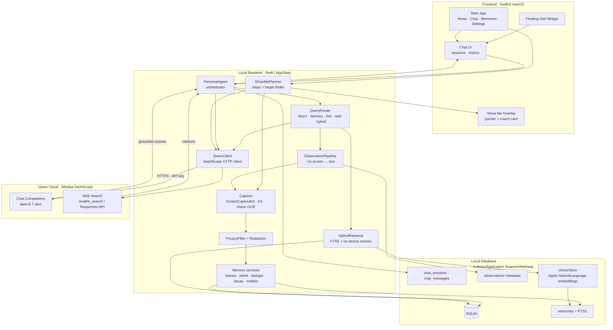

# iAletheia

**iAletheia** (Greek: ἀλήθεια — truth, un-forgetting) is a privacy-first **personal agent for macOS**.

It quietly learns from your screen, builds a private local memory, and answers with what you were actually working on — including **live screen awareness** (see the active window, draft email replies, review code), **Show Me** coaching so you learn by doing, and **Qwen Cloud** for reasoning and web search.

Built for **Track 1: MemoryAgent** — [Global AI Hackathon Series with Qwen Cloud](https://qwencloud-hackathon.devpost.com/).

<p align="center">
  
</p>

---

## Highlights

| Capability | What you get |
|---|---|
| **Personal memory** | Screen → OCR / Accessibility → local SQLite + FTS5 + on-device vectors (screenshots never saved) |
| **Live screen** | “What’s on my screen?” / draft email replies / review code — uses the **frontmost** window |
| **Show Me** | Step-by-step on-screen coach (pointer + chat) — you click; it never clicks for you |
| **Session chat** | Multi-turn awareness now; full **Chat History** of past sessions |
| **Smart routing** | Direct · memory · live screen · web · hybrid — via Qwen when configured |
| **Privacy** | Redaction, default exclusions, local Application Support storage |

---

## Features

### Memory & learning
- Continuous observation (~every 2s) of the frontmost window via **ScreenCaptureKit**, **Accessibility**, and **Vision OCR**
- Text is kept; **screenshots are discarded** after OCR (never persisted)
- Local **SQLite** store with **FTS5** full-text search and **on-device embeddings** (Apple NaturalLanguage)
- Hybrid retrieval: keyword + semantic search, with relative time (“yesterday”, “today”, “last week”)
- Memory types for research, people, projects, decisions, tasks, code, preferences, and more
- Admission / sensitivity gating, **decay** of stale memories, and **pin** for keepers
- **Smart entity memory** — merge the same people/topics, split homonyms, consolidate on launch
- Optional **Qwen structuring** of memories when cloud processing is enabled
- **Chat learning** — infers how you like answers (concise / detailed / technical) and injects that into prompts
- **Memories** browser: search, inspect type/confidence/topics, **Pin / Unpin**, **Forget**, **Delete All**
- **Home**: memory stats, recent items, Pause / Resume learning, **Capture Now**

### Live screen
- Ask about what’s open *right now* (describe app, summarize thread, draft a reply, review visible code)
- Targets the **frontmost user window** (multi-display / multi-window safe), not “largest window”
- Sticky window tracking so opening the owl/chat doesn’t steal the capture target
- Browser-aware capture (AX + OCR merge) for web apps like Gmail / Outlook
- Local fallback answers when Qwen is offline or cloud processing is off
- Follow-ups in the same chat reuse session context and refresh the live snapshot

### Show Me (learn by doing)
- Toggle **Show Me** in the chat footer — questions become guided walkthroughs instead of plain answers
- Qwen plans clear steps (local fallback plan if needed)
- Finds real UI targets with **Accessibility** + **OCR** bounding boxes
- Click-through overlay: **pointer + highlight** on the control; coach card with progress
- Auto-advances when you complete a step; gently corrects wrong actions
- **Next / Finish / End** controls — instructor mode only; **never auto-clicks**

### Chat & sessions
- Multi-turn chat (recent turns sent to the agent for continuity)
- Persisted **chat sessions** and messages in SQLite
- **Chat History**: open, continue, or delete past conversations; **New Chat**
- Inline **citations** for memory / web sources
- Live activity phases (Thinking, Retrieving, Searching, Drafting, Guiding…)
- Footer toggles: **Web** search and **Show Me**; Qwen connected vs Local only badge
- Compact chat inside the floating owl expand panel

### Smart routing (Qwen-powered)
- Routes each ask to **direct**, **memory**, **live_screen**, **web**, or **memory + web**
- Local heuristics first; Qwen JSON classification when configured
- Web search via **Qwen Cloud / DashScope** (`web_search` / `enable_search`) with citations
- Works in **local-only** mode with hybrid retrieval when no API key is set

### Privacy & control
- Redaction of passwords, cards, API keys, and similar secrets before storage
- Drops sign-in / password-manager / checkout-style windows from learning
- Default exclusions (e.g. 1Password, Keychain Access, iAletheia itself)
- Local data under `~/Library/Application Support/iAletheia/`
- Settings: enable/disable cloud answers via Qwen, enable/disable web search, clear all local data
- Secrets via **Keychain** (in-app) or `.env.local` (gitignored)

### Agent personality & About Me
- **About Me**: name, role, org, bio, interests, projects, goals → used in prompts
- **Agent** preferences: tone (Polite / Direct / Casual / Professional / Encouraging)
- Response length: Concise / Balanced / Detailed
- Address by name, emoji preference, custom personality text + live prompt preview

### App shell & UX
- Full macOS app: **Home**, **Memories**, **Chat**, **Chat History**, **About Me**, **Agent**, **Settings**
- Floating **owl** widget — drag to screen edges, pulse while observing, click to chat
- **Menu bar** extra: pause/resume learning, jump to Chat / Memories / Settings, permission hints
- App stays available after the main window is closed
- Permission prompts for **Screen Recording** and **Accessibility**

---

## Demo prompts

| Type | Example |
|---|---|
| Live screen | “Can you see my screen?” |
| Show Me | Toggle **Show Me**, then “Where can I find Capitalize?” |
| Email assist | “Draft a reply for this email” |
| Code context | “What am I looking at?” → “Is there any error in this?” |
| Personal recall | “What was I researching about storage yesterday?” |
| Live web | “What’s new with Qwen Cloud this month?” |
| Hybrid | “Compare what I read about HBM with current GPU specs” |

---

## Architecture Diagram

System overview for [Track 1: MemoryAgent](https://qwencloud-hackathon.devpost.com/) — how the **frontend**, **local backend**, **database**, and **Qwen Cloud** connect.

<p align="center">
  
</p>



### Request path (ask / follow-up)

```text
  User (Owl / Main Chat)
           │
           ▼
  PersonalAgent ──► QueryRouter (Qwen-assisted when configured)
           │
           ├── memory   → HybridRetriever → SQLite FTS5 + vectors
           ├── live     → ObservationPipeline → frontmost window text (AX + OCR)
           ├── web      → Qwen Cloud web_search
           └── hybrid   → memory + live and/or web
           │
           ▼
  QwenClient ──HTTPS──► DashScope (Qwen Cloud)
           │                    qwen3.7-plus · search
           ▼
  AnswerSanitizer → Chat UI + chat_messages (SQLite)
```

### Continuous memory path (background)

```text
  ScreenCaptureKit + Accessibility + Vision OCR
           │  frontmost window only; image discarded after OCR
           ▼
  PrivacyFilter / Redaction / Exclusions
           │
           ▼
  Memory extraction (+ optional Qwen structuring)
           │
           ▼
  SQLite memories · FTS5 · on-device embeddings
```

### Component map

| Layer | Components | Role |
|---|---|---|
| **Frontend** | SwiftUI Main app, Owl widget, Show Me overlay, Chat History | User interaction; never talks to DashScope directly |
| **Backend** | `PersonalAgent`, `QueryRouter`, `ObservationPipeline`, `ShowMePlanner` | Orchestration, routing, capture, guidance |
| **Database** | SQLite + FTS5, `VectorStore`, chat history repos | Persistent memory & sessions on device |
| **Qwen Cloud** | `QwenClient` → DashScope Compatible / Responses APIs | Reasoning, routing help, web search |

Alibaba Cloud / Qwen usage is implemented in [`Sources/iAletheia/Qwen/QwenClient.swift`](Sources/iAletheia/Qwen/QwenClient.swift).

### Privacy model

| Stage | Location |
|---|---|
| Screen capture & OCR | Local only |
| Memory & chat history | Local (`~/Library/Application Support/iAletheia/`) |
| Embeddings | On-device (Apple NaturalLanguage) |
| Screenshot persistence | **Never** (ephemeral capture only) |
| Qwen Cloud | Query-time reasoning / search only |
| Secrets | Keychain and/or `.env.local` (never committed) |

---

## Requirements

- macOS 14+
- Xcode 15+ / Swift 5.9+
- Apple Silicon recommended
- **Screen Recording** and **Accessibility** permissions
- A [DashScope / Qwen Cloud](https://www.alibabacloud.com/help/en/model-studio/) API key

---

## Quick start

```bash
git clone https://github.com/vnmrsharma/iAletheia.git
cd iAletheia

cp .env.local.example .env.local
# Edit .env.local and set QWEN_API_KEY

chmod +x run.sh
./run.sh
```

Or manually:

```bash
cp .env.local.example .env.local   # then add your key
swift build -c release
.build/release/iAletheia
```

### Permissions

1. Launch the app (menu bar / floating owl)
2. Grant **Screen Recording** and **Accessibility** for iAletheia
3. Click the owl to chat

### Configuration

| Source | Priority |
|---|---|
| Keychain (Settings in-app) | Highest |
| `.env.local` | Next |
| Environment variables | Fallback |

`.env.local` is **gitignored**. Only commit `.env.local.example` (placeholders).

Example `.env.local`:

```env
QWEN_API_KEY=sk-your-dashscope-api-key-here
QWEN_BASE_URL=https://dashscope-intl.aliyuncs.com/compatible-mode/v1
QWEN_TEXT_MODEL=qwen3.7-plus
```

---

## Project structure

```text
Sources/iAletheia/
├── App/            AppState, DependencyContainer, entry
├── Capture/        ScreenCaptureKit, Accessibility, active window
├── Chat/           Session models + chat history persistence
├── Privacy/        Filters, redaction, exclusions
├── Observation/    Live snapshot + observation pipeline
├── Memory/         Extraction, entities, chat learning
├── Retrieval/      Hybrid FTS + vector search
├── Tools/          PersonalAgent, QueryRouter, web helpers
├── ShowMe/         Planner, target finder, overlay coach
├── Qwen/           DashScope client, AnswerSanitizer
├── Storage/        SQLite, repositories, preferences
└── UI/             Main app, owl widget, chat, inspector
```

---

## Hackathon submission

- **Track:** MemoryAgent (Track 1) — [Qwen Cloud Hackathon](https://qwencloud-hackathon.devpost.com/)
- **Repository:** https://github.com/vnmrsharma/iAletheia
- **License:** MIT
- **Architecture diagram:** see [Architecture Diagram](#architecture-diagram) above (frontend ↔ local backend ↔ SQLite ↔ Qwen Cloud)
- **Alibaba Cloud proof:** Qwen / DashScope via [`QwenClient.swift`](Sources/iAletheia/Qwen/QwenClient.swift)
- **Differentiator:** Local visual memory + live frontmost-window awareness + Show Me coach + session chat; not a generic chatbot

---

## License

MIT — see [LICENSE](LICENSE).
